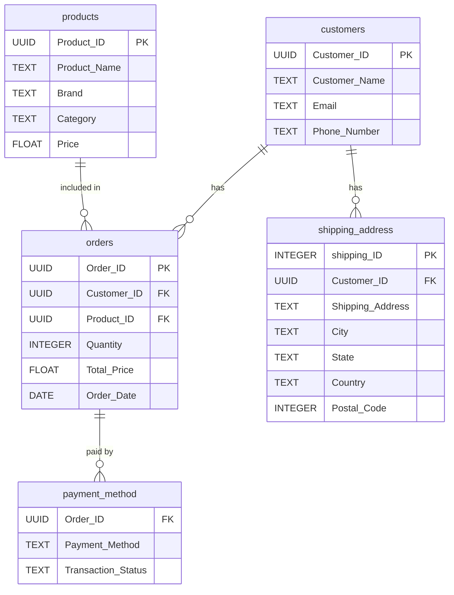

# Yanki E-commerce Data Engineering Project

## Overview

This project demonstrates a complete data engineering workflow for an e-commerce dataset using Python, PostgreSQL, and Jupyter Notebook. It covers data cleaning, normalization, schema design, and loading data into a relational database for further analytics.

## Project Structure

```
yanki-ecommerce-efl/
├── dataset/
│   ├── rawdata/
│   │   └── yanki_ecommerce.csv
│   └── cleandata/
│       ├── customers.csv
│       ├── products.csv
│       ├── shipping_address.csv
│       ├── orders.csv
│       └── payment_method.csv
├── scenarios/
│   └── case_study.md
├── yanki.ipynb
├── requirements.txt
├── .env
└── README.md
```

## Features

- Cleans and normalizes raw e-commerce data using pandas
- Splits data into customers, products, shipping address, orders, and payment method tables
- Uses environment variables for secure database connection
- Creates PostgreSQL schema and tables programmatically
- Loads cleaned data into PostgreSQL using psycopg2
- Modular notebook cells for each ETL step

## Setup Instructions

### 1. Clone the Repository

```sh
git clone https://github.com/esodevops/yanki-ecommerce-efl.git
cd yanki-ecommerce-efl
```

### 2. Install Dependencies

```sh
pip install -r requirements.txt
```

### 3. Configure Environment Variables

Create a `.env` file in the project root with the following content:

```
DB_HOST=localhost
DB_NAME=yanki_ecommerce
DB_USER=postgres
DB_PASSWORD=your_password
```

### 4. Prepare the Database

- Ensure PostgreSQL is running and accessible.
- The notebook will create the database and schema if they do not exist.

### 5. Run the Notebook

Open `yanki.ipynb` in Jupyter and execute the cells in order:

1. Data cleaning and normalization
2. Database connection and schema/table creation
3. Data loading into PostgreSQL

### 6. Access PostgreSQL from Terminal

Use any of the following methods to connect with `psql` from your terminal.

Option A: Connect directly to the target database

```sh
psql -h localhost -U postgres -d yanki_ecommerce
```

Option B: Use environment variables from `.env`

```sh
export PGHOST=localhost
export PGUSER=postgres
export PGPASSWORD=your_password
export PGDATABASE=yanki_ecommerce
psql
```

Option C: Connect first to the default database and switch

```sh
psql -h localhost -U postgres -d postgres
\c yanki_ecommerce
```

### 7. Query the Database from Terminal

After connecting with `psql`, run these commands:

List schemas:

```sql
\dn
```

List tables in `yanki` schema:

```sql
\dt yanki.*
```

Describe a table structure:

```sql
\d yanki.customers
```

Count rows in each table:

```sql
SELECT 'customers' AS table_name, COUNT(*) FROM yanki.customers
UNION ALL
SELECT 'products', COUNT(*) FROM yanki.products
UNION ALL
SELECT 'shipping_address', COUNT(*) FROM yanki.shipping_address
UNION ALL
SELECT 'orders', COUNT(*) FROM yanki.orders
UNION ALL
SELECT 'payment_method', COUNT(*) FROM yanki.payment_method;
```

Sample reporting queries:

```sql
SELECT COUNT(*) AS total_orders, SUM(total_price) AS total_revenue
FROM yanki.orders;

SELECT payment_method, COUNT(*) AS transactions
FROM yanki.payment_method
GROUP BY payment_method
ORDER BY transactions DESC;
```

Exit `psql`:

```sql
\q
```

## File Descriptions

- `yanki.ipynb`: Main notebook with all ETL logic and database operations
- `dataset/rawdata/yanki_ecommerce.csv`: Raw input data
- `dataset/cleandata/`: Cleaned, normalized CSVs for each table
- `.env`: Environment variables for database credentials (not committed)
- `requirements.txt`: Python dependencies
- `scenarios/case_study.md`: Project scenario and case study

## Usage Notes

- The notebook is modular; you can adapt the schema or add new tables as needed.
- All SQL operations are idempotent (safe to re-run).
- Data loading uses ON CONFLICT DO NOTHING to avoid duplicate inserts.

## License

MIT License

## Author

Sulaimon (update with your name/email if needed)

## Yanki Data Model

The data model consists of five main tables in the `yanki` schema:

- **customers**: Stores customer information (Customer_ID, Customer_Name, Email, Phone_Number)
- **products**: Stores product details (Product_ID, Product_Name, Brand, Category, Price)
- **shipping_address**: Stores shipping addresses for customers (shipping_ID, Customer_ID, Shipping_Address, City, State, Country, Postal_Code)
- **orders**: Stores order transactions (Order_ID, Customer_ID, Product_ID, Quantity, Total_Price, Order_Date)
- **payment_method**: Stores payment details for orders (Order_ID, Payment_Method, Transaction_Status)

### Entity-Relationship Diagram (ERD)



This ERD shows the relationships between the tables and their key fields. Foreign keys are indicated by `FK`, and primary keys by `PK`.
